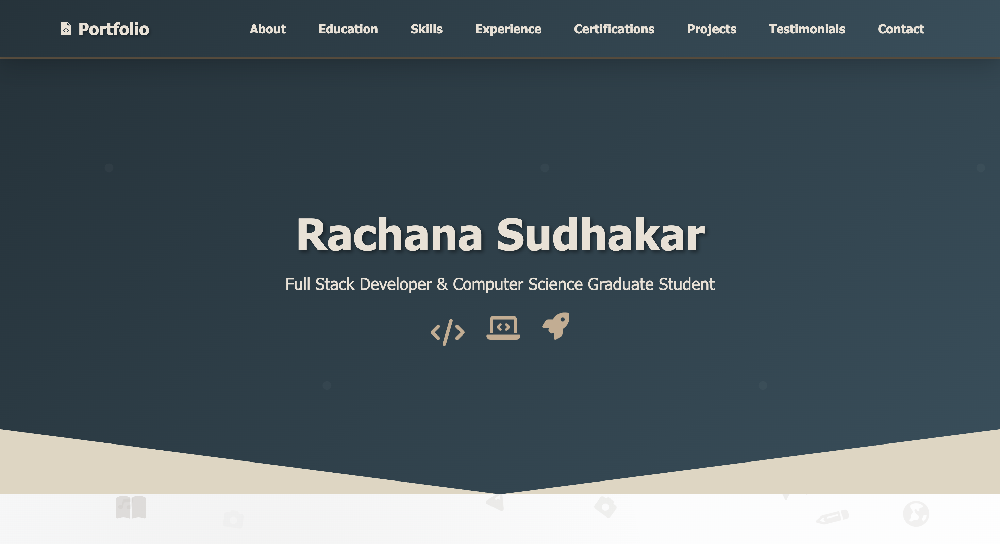
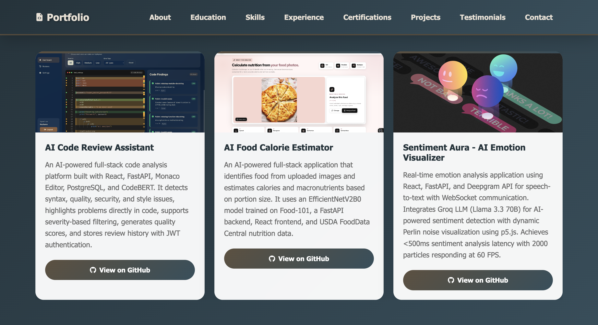
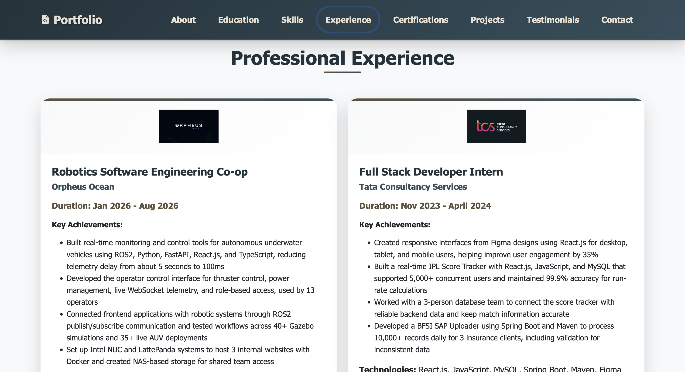
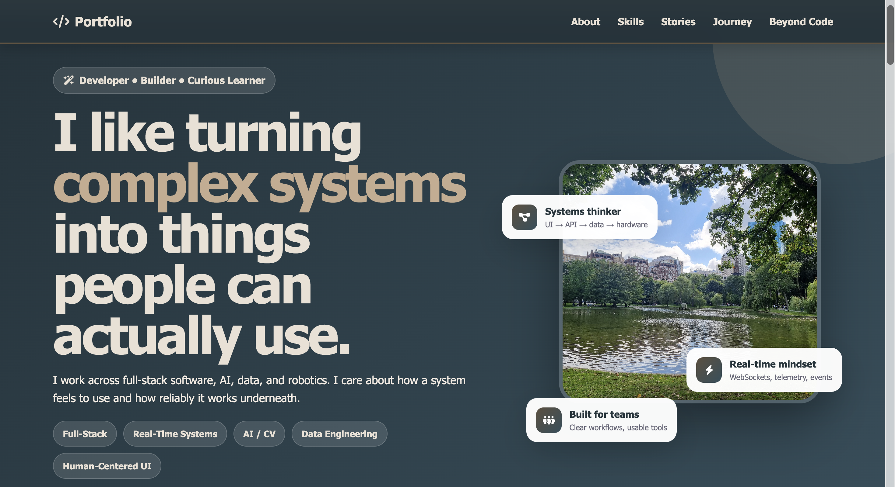
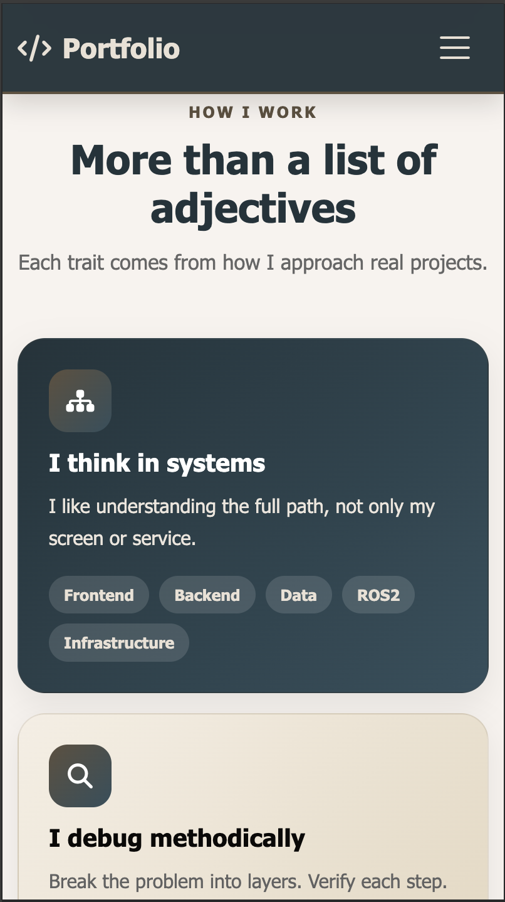

# 🌟 Rachana Sudhakar - Portfolio

A modern, responsive software engineering portfolio showcasing my work across **full-stack development, AI, data engineering, robotics, and real-time systems**.

The portfolio brings together my professional experience, technical projects, skills, education, and personal journey in an interactive and visually engaging website.

## 🚀 Live Portfolio

🌐 **[View Live Portfolio](https://rachana1707-s.github.io/portfolio/)**

---

## 📸 Portfolio Preview

### 🏠 Home



A modern landing page introducing my background, technical interests, experience, and featured work.

### 🚀 Featured Projects



A collection of projects across **AI, full-stack development, developer tools, data engineering, and software engineering**.

### 💼 Professional Experience



Highlights from my software engineering experience, including robotics software development and full-stack engineering.

### 🧭 My Journey



An interactive page showing how I approach engineering, the skills I have developed, project stories, milestones, and interests beyond coding.

### 📱 Mobile Experience

<p align="center">
  
</p>

The portfolio is fully responsive across desktop, tablet, and mobile devices.

---

## ✨ Highlights

- 🎨 Modern responsive user interface
- 💻 Full-stack, AI, data engineering, and robotics projects
- 🔎 Interactive project filtering
- 🧠 Visual skills and project stories
- 💼 Professional software engineering experience
- 🎓 Education and certifications
- 🧭 Interactive personal journey page
- 📱 Mobile-responsive layouts
- ✨ Scroll animations and hover interactions
- ♿ Keyboard-friendly interactive elements
- ⚡ Lightweight static deployment with GitHub Pages

---

## 👩‍💻 About the Portfolio

This portfolio represents the different areas of software engineering I enjoy working across:

- Full-stack software engineering
- Backend APIs and databases
- Artificial intelligence and computer vision
- Data engineering and ETL pipelines
- Real-time systems
- Robotics software
- Human-centered interfaces

Instead of only listing technologies, the portfolio focuses on showing how I have applied them through **real projects and professional experience**.

---

# ⭐ Featured Projects

## 🤖 AI Code Review Assistant

An AI-powered developer tool that analyzes source code and identifies syntax, quality, security, and maintainability issues.

### Key Features

- React frontend with Monaco Editor
- FastAPI backend
- PostgreSQL review history
- JWT authentication
- Python AST analysis
- Pylint and Flake8 integration
- CodeBERT-assisted analysis
- Issue severity filtering
- Line-level issue highlighting

🔗 **[View Repository](https://github.com/rachana1707-S/AI-Code-Review-Assistant)**

---

## 🍽️ AI Food Calorie Estimator

A computer vision application that recognizes food from images and estimates calories and nutritional information.

### Key Features

- EfficientNetV2B0
- Food-101 dataset
- Transfer learning
- FastAPI backend
- React frontend
- USDA FoodData Central integration
- Nutrition estimation

🔗 **[View Repository](https://github.com/rachana1707-S/ai-food-calorie-estimator)**

---

## 🌊 Ocean Sensor Data Pipeline

An end-to-end data engineering pipeline that collects, processes, stores, and visualizes live NOAA ocean sensor data.

### Key Features

- NOAA CO-OPS API ingestion
- Automated data collection
- pandas-based cleaning and transformation
- Data validation
- Automated quality scoring
- PostgreSQL storage
- APScheduler
- Streamlit dashboard
- Plotly visualizations
- Docker Compose

🔗 **[View Repository](https://github.com/rachana1707-S/ocean-pipeline)**

---

## 🎨 Sentiment Aura

A real-time AI sentiment visualization application that transforms speech and sentiment into dynamic visual experiences.

### Key Features

- Speech-to-text processing
- LLM-based sentiment analysis
- FastAPI
- React
- WebSockets
- Deepgram
- Groq
- p5.js visualization
- Real-time communication

🔗 **[View Repository](https://github.com/rachana1707-S/Sentiment-Aura)**

---

## 🍴 FoodSocial

A full-stack social food discovery platform designed around restaurant discovery and sharing food experiences.

### Key Features

- Restaurant discovery
- User authentication
- Reviews and social interactions
- User collections
- Location-based features
- Responsive interface
- Backend API integration
- Database-backed user data

🔗 **[View Repository](https://github.com/rachana1707-S/FoodSocial)**

---

## 🖼️ Image Processing Application

A Java-based image processing application supporting multiple image manipulation and enhancement operations.

### Key Features

- MVC architecture
- GUI and CLI interfaces
- Image filters
- Histograms
- Color correction
- Image transformations
- Haar wavelet compression
- Object-oriented design

🔗 **[View Repository](https://github.com/rachana1707-S/ImageProcessing)**

---

# 💼 Professional Experience

## 🤖 Robotics Software Engineering Co-op

### Orpheus Ocean

Worked across robotics software, full-stack development, real-time telemetry, simulation, operator interfaces, and internal engineering infrastructure.

### Technologies

`React` `TypeScript` `Python` `FastAPI` `WebSockets` `ROS2` `Gazebo` `NVIDIA Jetson` `Docker`

### Highlights

- Built real-time interfaces for monitoring and controlling autonomous underwater vehicles
- Worked with ROS2 publisher/subscriber architecture
- Developed operator-facing interfaces for telemetry and vehicle control
- Improved real-time telemetry communication
- Tested systems through Gazebo simulations and live AUV deployments
- Worked with Intel NUC and LattePanda systems
- Supported internal engineering infrastructure and NAS-based workflows

---

## 💻 Full Stack Developer Intern

### Tata Consultancy Services

Worked on responsive applications, real-time sports systems, backend services, and database-backed workflows.

### Technologies

`Java` `Spring Boot` `React` `SQL` `REST APIs`

### Highlights

- Developed responsive web interfaces
- Worked on a real-time IPL score tracking system
- Built database-backed application functionality
- Collaborated with a database development team
- Worked on enterprise data processing workflows

---

# 🛠️ Technical Skills

## Languages

`Python` `Java` `JavaScript` `TypeScript` `SQL` `HTML` `CSS`

## Frontend

`React` `Bootstrap` `CSS Grid` `Flexbox` `Responsive Design`

## Backend

`FastAPI` `Spring Boot` `Node.js` `REST APIs`

## Databases

`PostgreSQL` `MySQL` `SQLAlchemy`

## AI / Machine Learning

`TensorFlow` `PyTorch` `Hugging Face` `CodeBERT` `Computer Vision` `NLP`

## Data Engineering

`pandas` `NumPy` `ETL Pipelines` `Data Validation` `REST APIs`

## Robotics & Real-Time Systems

`ROS2` `Gazebo` `WebSockets` `Telemetry`

## Developer Tools

`Docker` `Git` `GitHub` `Linux`

---

# 🏗️ Project Structure

```text
portfolio/
│
├── index.html
├── aboutme.html
│
├── portfolio.css
├── aboutme.css
│
├── portfolio.js
├── aboutme.js
│
├── README.md
│
├── screenshots/
│   ├── portfolio-home.png
│   ├── portfolio-projects.png
│   ├── portfolio-experience.png
│   ├── about-journey.png
│   └── mobile-view.png
│
└── assests/
    ├── aboutme/
    ├── exp/
    ├── journey/
    ├── project images
    ├── university logos
    └── resume
```

> **Note:** The project currently uses the folder name `assests`. If it is renamed to `assets`, all corresponding HTML and CSS paths must also be updated.

---

# 🧩 Portfolio Sections

## 🏠 Home

The hero section introduces who I am and the areas of software engineering I work across.

It provides quick access to:

- Projects
- Professional experience
- My Journey
- Resume
- Contact information

---

## 👤 About

Provides a short introduction to my background, interests, and engineering approach.

A separate **My Journey** page provides a deeper look into my experiences and growth.

---

## 💼 Experience

Highlights my professional experience in:

- Robotics software engineering
- Full-stack development
- Real-time systems
- Backend development
- Software infrastructure

---

## 🚀 Projects

Projects can be explored using interactive category filters.

Categories include:

- All
- AI / ML
- Full-Stack
- Developer Tools
- Data Engineering

---

## 🛠️ Skills

Technical skills are organized by area to make the portfolio easy to scan.

---

## 🎓 Education

Highlights my academic background, including my graduate studies in Computer Science at Northeastern University.

---

## 📜 Certifications

Displays professional and technical certifications completed throughout my academic and professional journey.

---

## 📬 Contact

Provides quick ways for recruiters, engineers, and collaborators to connect with me.

---

# 🧭 My Journey Page

The `aboutme.html` page provides a more personal and visual view of my engineering journey.

It highlights:

- Systems thinking
- Methodical debugging
- Human-centered design
- Testing and reliability
- Adaptability
- Team-oriented development
- Technical skills
- Project stories
- Career milestones
- Interests beyond coding

Interactive elements include:

- Skill filtering
- Expandable project stories
- Timeline highlighting
- Scroll reveal animations
- Responsive bento-style layouts

---

# 🎨 Design System

The portfolio uses a consistent custom color palette.

```css
:root {
  --dark-navy: #22333b;
  --teal-blue: #334f5c;
  --warm-brown: #5e503f;
  --cream: #eae0d5;
  --warm-beige: #c6ac8f;
}
```

### UI Elements

The design includes:

- Rounded cards
- Soft shadows
- Gradient accents
- Pill-shaped technology tags
- Hover interactions
- Scroll reveal animations
- CSS Grid
- Flexbox
- Responsive layouts

---

# 🚀 Getting Started

## Prerequisites

You only need:

- A modern web browser
- Git
- A code editor such as VS Code

---

## 1. Clone the Repository

```bash
git clone https://github.com/rachana1707-S/portfolio.git
cd portfolio
```

---

## 2. Open the Project

If you use VS Code:

```bash
code .
```

---

## 3. Start a Local Server

Using Python:

```bash
python3 -m http.server 8000
```

Then open:

```text
http://localhost:8000
```

You can also use the **Live Server** extension in VS Code.

---

# 🌐 Deployment

The portfolio is deployed using **GitHub Pages**.

🌐 **[Live Website](https://rachana1707-s.github.io/portfolio/)**

After making changes:

```bash
git add .
git commit -m "feat: update portfolio"
git push origin main
```

GitHub Pages will deploy the latest version from the configured branch.

---

# 📷 README Images Required

Create a `screenshots` folder in the root of the repository:

```bash
mkdir -p screenshots
```

Your folder should contain:

```text
screenshots/
├── portfolio-home.png
├── portfolio-projects.png
├── portfolio-experience.png
├── about-journey.png
└── mobile-view.png
```

## 1. `portfolio-home.png`

Take a desktop screenshot of the **top of your portfolio**.

It should include:

- Navigation bar
- Hero section
- Your name
- Software engineering introduction
- Main CTA buttons
- Some of the next section if possible

Recommended size:

```text
1440 × 900
```

---

## 2. `portfolio-projects.png`

Take a screenshot of the **Projects section**.

Make sure it shows:

- Projects heading
- Category/filter buttons
- At least 3 project cards
- Project images
- Technology tags

Recommended size:

```text
1440 × 900
```

---

## 3. `portfolio-experience.png`

Take a screenshot of your **Experience section**.

Try to show both:

```text
Orpheus Ocean
Tata Consultancy Services
```

Recommended size:

```text
1440 × 900
```

---

## 4. `about-journey.png`

Use your redesigned **My Journey** page.

The best screenshot would be either:

```text
How I Work
```

or:

```text
Project Stories
```

The **How I Work bento section** would be my first choice because it makes the portfolio look more unique.

Recommended size:

```text
1440 × 900
```

---

## 5. `mobile-view.png`

Open Chrome DevTools:

```text
Right Click
→ Inspect
→ Toggle Device Toolbar
```

Use approximately:

```text
390 × 844
```

Then take a screenshot showing:

- Navigation
- Hero
- Main content
- Responsive cards

This screenshot is intentionally displayed smaller in the README.

---

# 📸 Recommended Screenshot Folder

After adding the images:

```text
portfolio/
│
├── README.md
│
├── index.html
├── aboutme.html
│
├── portfolio.css
├── aboutme.css
│
├── portfolio.js
├── aboutme.js
│
└── screenshots/
    ├── portfolio-home.png
    ├── portfolio-projects.png
    ├── portfolio-experience.png
    ├── about-journey.png
    └── mobile-view.png
```

---

# ⚡ Performance

The portfolio focuses on lightweight frontend development using:

- Optimized images
- Responsive image sizing
- CSS-based animations
- Efficient DOM event handling
- Intersection Observer for scroll effects
- Minimal external dependencies

---

# 🔮 Future Improvements

- [ ] Add live demo links for more projects
- [ ] Add dark/light theme switching
- [ ] Add automated Lighthouse checks
- [ ] Add accessibility testing
- [ ] Add GitHub Actions for HTML/CSS validation
- [ ] Add portfolio analytics
- [ ] Continue improving mobile layouts
- [ ] Add additional project case studies

---

# 👩‍💻 Author

## Rachana Sudhakar

**MS Computer Science**  
Northeastern University

📍 Boston, Massachusetts

🌐 [Portfolio](https://rachana1707-s.github.io/portfolio/)

🐙 [GitHub](https://github.com/rachana1707-S)

💼 [LinkedIn](https://linkedin.com/in/rachanasudhakar)

✉️ [Email](mailto:rachanasudhakar17@gmail.com)

---

⭐ **If you find my work interesting, feel free to explore the projects and connect with me.**

Built with ❤️ by **Rachana Sudhakar**